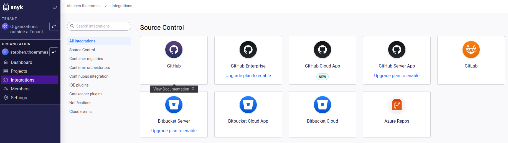
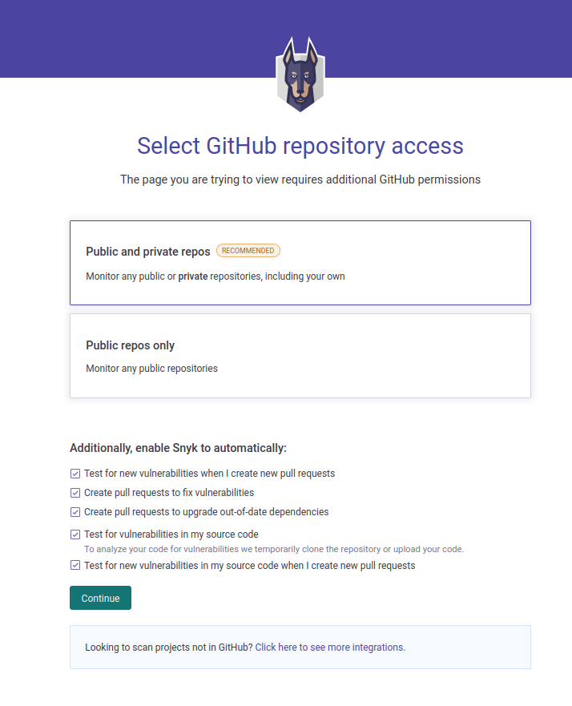
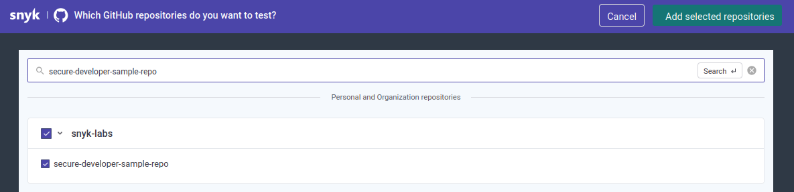
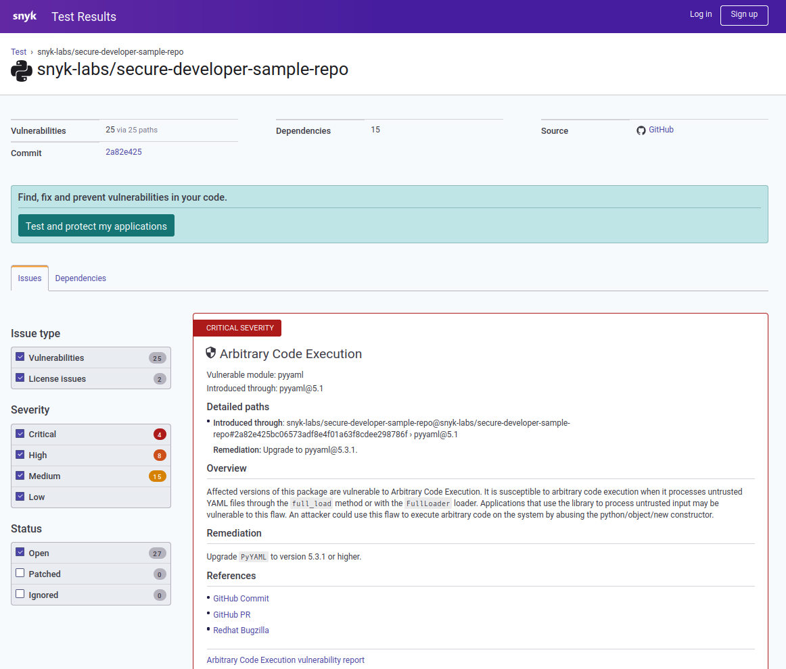
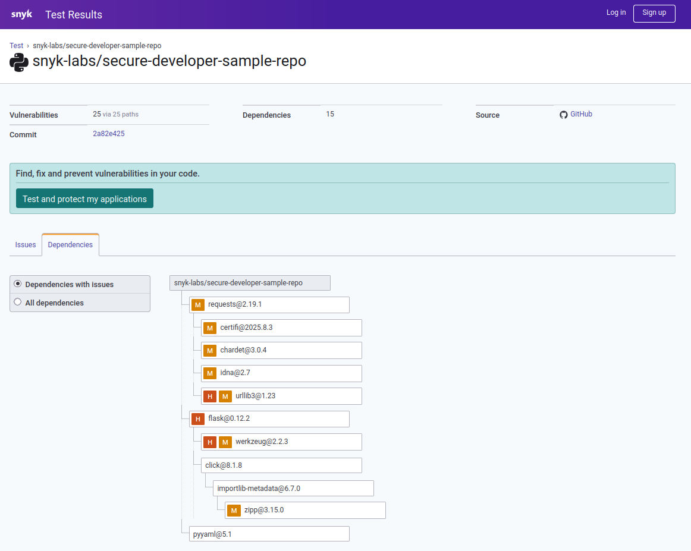
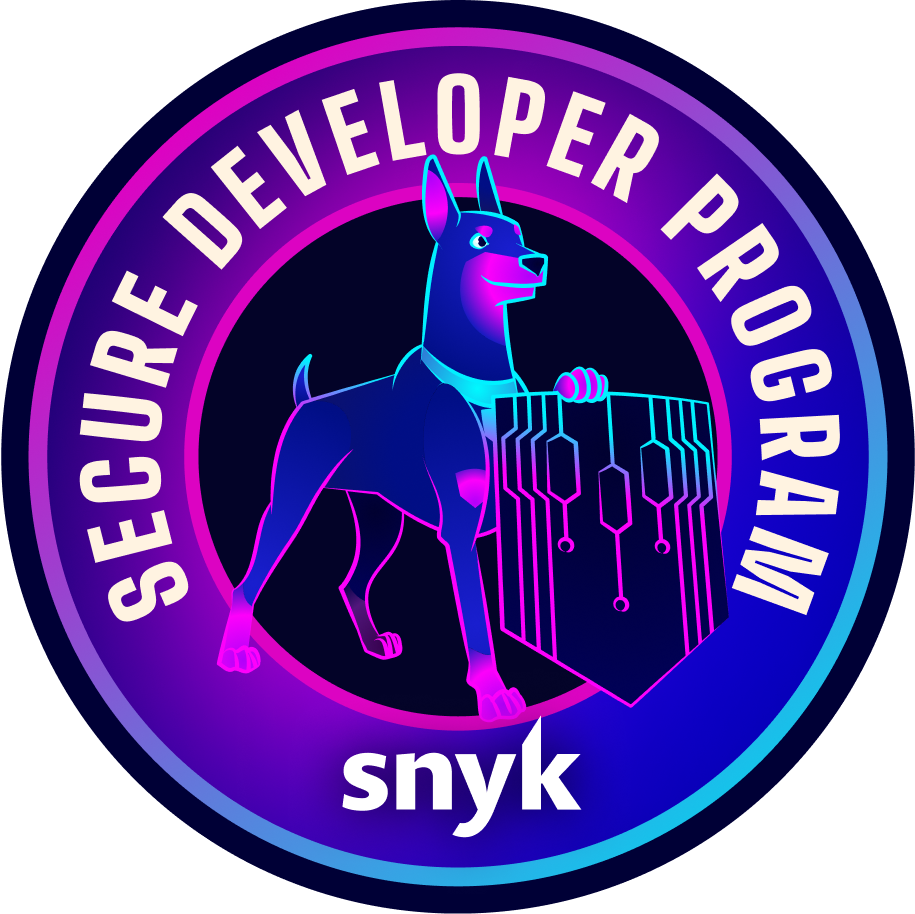
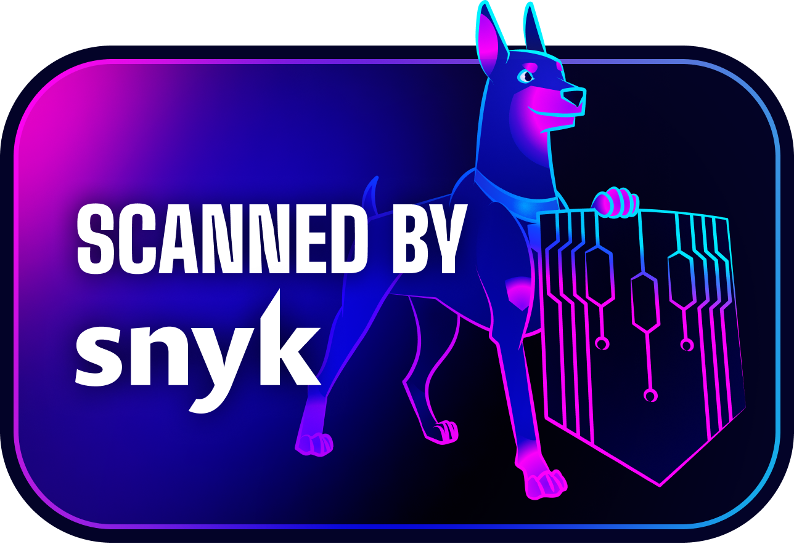

# Snyk Badges -- Examples for Secure Developer GitHub Repos
---> [](https://snyk.io/test/github/snyk-labs/secure-developer-sample-repo) <---


Your repo on GitHub can contain badges reflecting Snyk scan results. The scan can occur on the built package on NPM, PyPi, or other platforms; or it can scan the code on GitHub directly. This repo contains some vulnerabilities deliberately. It contains:

* Vulnerable `app.py` for SAST / code scanning demonstration
* Manifest file `requirements.txt` containing outdated (vulnerable) versions of packages
* Terraform files to demonstrate Snyk IaC scanning

Try clicking on the badge at the top of this README to see the [full scan results](https://snyk.io/test/github/snyk-labs/secure-developer-sample-repo) for this demo codebase.

Open source projects can join Snyk's [Secure Developer Program](https://snyk.io/open-source/) to obtain access to Enterprise security features for free. One of the few requirements for joining the program is to include a reference to Snyk in your project's README. The badges shown off in this demo repo are all valid ways of doing that. You can also/alternatively use the PNG badges at the bottom of this demo README.

## Setting up badges for public repositories
### Step 1: Create a Snyk account

1. Navigate to https://snyk.io and click "Sign up" (it will be free)
2. Choose GitHub OAuth for easier integration
3. Authorize Snyk to access your GitHub account

### Step 2: Import your GitHub repository

1. In Snyk dashboard, go to `Integrations → Source Control → GitHub Snyk` 



2. Click "Add your GitHub repositories to Snyk". You may need to grant Snyk some additional permissions:



3. Select the repositories you want to monitor (you can search for them by name)



4. Wait for initial vulnerability scan to complete (usually 1-2 minutes)

5. If your repo does not have any code yet, now would be a good time to add some. This repo contains some deliberately vulnerable code in `app.py`.


6. If you do not have a manifest file, you'll want to configure one appropriate for your project. A manifest file is just a file from your language that is standard for indicating your dependencies. If you want Open Source dependency scanning, you’ll need at least one of the supported manifests:

`Python → requirements.txt, Pipfile, or pyproject.toml`

`Node.js → package.json`

`Java → pom.xml or build.gradle`

This repository contains a `requirements.txt` file with some deliberately outdated dependencies to show off vulnerability scanning.


7. The natural next step would be to set up GitHub Actions with Snyk. You can explore some options for this [here](https://github.com/snyk/actions). But for now, you've done enough to create your badge(s).

## GitHub Badges
For a scan that is configured to scan your code on an open source GitHub repo directly:

Basic GitHub badge:
```
[](https://snyk.io/test/github/{username}/{repo})
```

In our case:
```
[](https://snyk.io/test/github/snyk-labs/secure-developer-sample-repo)
```

Which comes out looking like this:
[](https://snyk.io/test/github/snyk-labs/secure-developer-sample-repo)

Or for specific branch:
```
[](https://snyk.io/test/github/{username}/{repo}/{branch})
```

Targeting a specific manifest file (if you have a monorepo with multiple `requirements.txt` files, for example):
```
[](https://snyk.io/test/github/{username}/{repo}?targetFile=package.json)
```

Using custom styling:
```
[](https://snyk.io/test/github/{username}/{repo})
```

An example combining these parameters:
```
[](https://snyk.io/test/github/{username}/{repo}?targetFile=package.json)
```

## NPM Package Badges
For a scan that is configured to scan your code on NPM:


Basic npm badge:
```
[](https://snyk.io/test/npm/{package-name})
```

Specific version:
```
[](https://snyk.io/test/npm/{package-name}/{version})
```

## PyPI package badges
For a scan that is configured to scan your code on PyPi:

Basic PyPi badge:
```
[](https://snyk.io/test/pip/{package-name})
```

## Maven Central badges
For a scan that is configured to scan your code on Maven Central:
Basic Maven badge:
```
[](https://snyk.io/test/maven/{groupId}/{artifactId})
```

## PHP Composer badges
For a scan that is configured to scan your code on PHP Composer:

Basic PHP badge:
```
[](https://snyk.io/test/composer/{vendor}/{package})
```

## PNG Badges

### Reduced Size (25%):


<!--  -->


### Full Size:


<!-- 
 -->


## SVG Badges

### Reduced Size (10%):


### Full Size:


